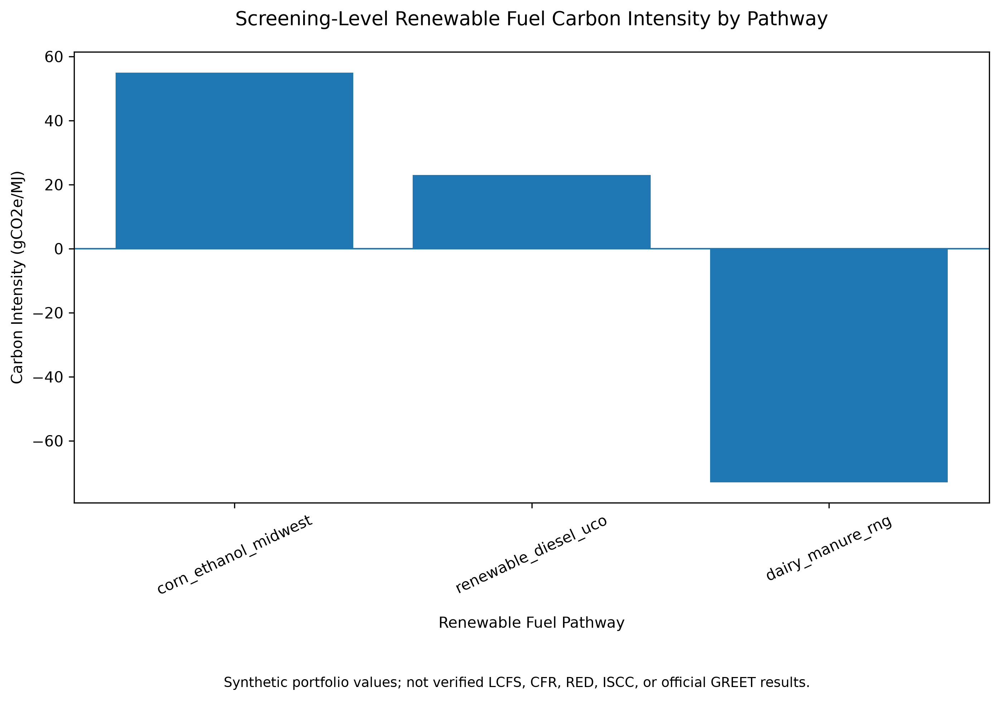
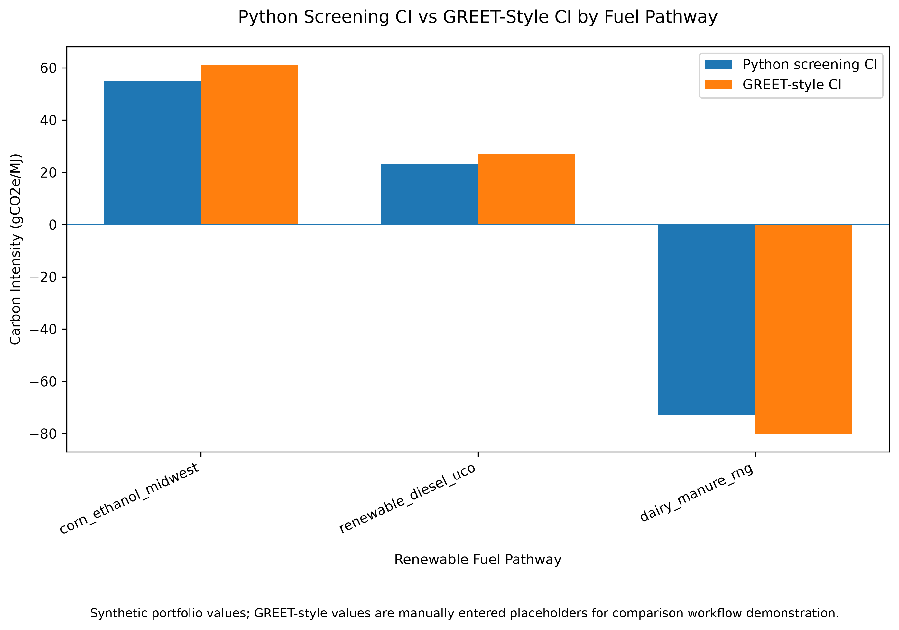
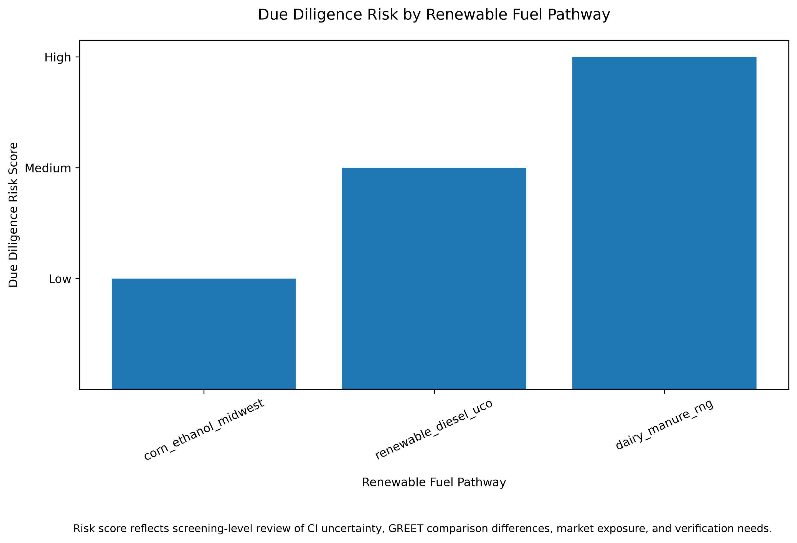

# Renewable Fuel Carbon Intensity Modeling and Due Diligence Tool

## Overview

This project is a screening-level renewable fuel carbon intensity model for ethanol, renewable diesel, and dairy manure renewable natural gas (RNG) pathways. It demonstrates how Python-based lifecycle carbon intensity calculations can be combined with GREET-style comparison, QA/QC checks, and due diligence risk scoring to support low-carbon fuel market analysis.

The project was designed as a portfolio prototype for roles involving renewable fuel LCA, carbon intensity modeling, biofuel/RNG due diligence, and compliance-market analysis across LCFS, RED, CFR, ISCC, and GREET-style frameworks.

## Business Purpose

Renewable fuel projects are often evaluated not only by whether they reduce emissions, but also by how defensible their carbon intensity (CI) results are under compliance-market review. A low or negative CI value may create commercial value, but it can also introduce higher verification, methodology, feedstock, allocation, and eligibility risks.

This project models that tradeoff by comparing three renewable fuel pathways:

* Corn ethanol, Midwest
* Renewable diesel from used cooking oil
* Dairy manure RNG

The goal is to show how CI modeling can support both technical LCA interpretation and commercial due diligence.

## Key Questions

This prototype answers four practical questions:

1. What is the screening-level carbon intensity of each renewable fuel pathway?
2. How do Python-based CI estimates compare with GREET-style reference values?
3. Which pathways carry higher due diligence risk?
4. How can CI results be translated into commercial and compliance-market insights?

## Methodology

The model calculates carbon intensity in grams of carbon dioxide equivalent per megajoule of fuel energy output:

```text
CI = total lifecycle emissions / fuel energy output
```

The lifecycle emissions estimate includes:

* Feedstock emissions
* Process energy emissions
* Transport emissions
* Coproduct credits
* Avoided methane credits

The current version uses synthetic portfolio data for demonstration purposes. It is not a certified pathway submission.

## Project Workflow

```text
Fuel pathway input data
        ↓
Python CI calculation
        ↓
QA/QC and risk flags
        ↓
GREET-style comparison
        ↓
Due diligence risk scoring
        ↓
Charts and portfolio outputs
```

## Charts

### 1. Screening-Level Carbon Intensity by Fuel Pathway

This chart compares the modeled carbon intensity values for corn ethanol, renewable diesel from used cooking oil, and dairy manure RNG.

[View chart](outputs/charts/ci_comparison_chart.png)



### 2. Python Screening CI vs GREET-Style CI

This chart compares the Python screening model results with manually entered GREET-style reference values. The purpose is to demonstrate a model comparison workflow, not to claim official GREET validation.

[View chart](outputs/charts/python_vs_greet_ci_comparison.png)



### 3. Due Diligence Risk by Fuel Pathway

This chart translates CI results and model-comparison differences into a due diligence risk score. It highlights that lower CI does not automatically mean lower commercial or verification risk.

[View chart](outputs/charts/due_diligence_risk_chart.png)



## Key Results

| Pathway                                | Screening CI Result | Due Diligence Interpretation                                                                                                      |
| -------------------------------------- | ------------------: | --------------------------------------------------------------------------------------------------------------------------------- |
| Corn ethanol, Midwest                  |           Higher CI | Lower risk because the pathway is more familiar and less dependent on avoided-emissions claims                                    |
| Renewable diesel from used cooking oil |            Lower CI | Medium risk because results are sensitive to feedstock eligibility, allocation, and methodology assumptions                       |
| Dairy manure RNG                       |         Negative CI | High risk because commercial value depends heavily on avoided methane assumptions, project boundary, monitoring, and verification |

## Why This Matters

For low-carbon fuel markets, the most attractive pathway is not always the lowest-risk pathway. Dairy manure RNG may show strong negative CI potential, but it requires careful verification of avoided methane assumptions. Renewable diesel from used cooking oil may show attractive CI results, but feedstock traceability and eligibility can drive compliance risk. Corn ethanol may have a higher CI, but the pathway can be more familiar and easier to review.

This project demonstrates how CI modeling can support technical analysis, due diligence, and commercial decision-making.

## Repository Structure

```text
renewable-fuel-ci-model/
│
├── Data-raw/
│   └── fuel_pathway_inputs.xlsx
│
├── Data-processed/
│   ├── ci_results.csv
│   └── due_diligence_flags.csv
│
├── GREET/
│   ├── exports/
│   │   └── greet_results_manual.xlsx
│   └── comparison/
│       └── python_vs_greet_comparison.csv
│
├── outputs/
│   └── charts/
│       ├── ci_comparison_chart.png
│       ├── python_vs_greet_ci_comparison.png
│       └── due_diligence_risk_chart.png
│
├── src/
│   ├── main.py
│   ├── greet_comparison.py
│   ├── due_diligence_engine.py
│   ├── create_ci_chart.py
│   ├── create_greet_comparison_chart.py
│   └── create_due_diligence_risk_chart.py
│
├── README.md
└── .gitignore
```

## How to Run

From the project folder:

```powershell
.\.venv\Scripts\python.exe .\src\main.py
.\.venv\Scripts\python.exe .\src\greet_comparison.py
.\.venv\Scripts\python.exe .\src\due_diligence_engine.py
.\.venv\Scripts\python.exe .\src\create_ci_chart.py
.\.venv\Scripts\python.exe .\src\create_greet_comparison_chart.py
.\.venv\Scripts\python.exe .\src\create_due_diligence_risk_chart.py
```

## Tools Used

* Python
* pandas
* matplotlib
* Excel
* GREET-style comparison workflow
* GitHub

## Limitations

This is a screening-level portfolio model using synthetic demonstration data. It is not a verified LCFS, CFR, RED, ISCC, or official GREET submission. Final compliance use would require approved regulatory tools, primary project data, pathway-specific guidance, documented assumptions, third-party verification, and applicable market-specific review.

## Relevance to Renewable Fuel and Carbon Market Roles

This project demonstrates applied skills in:

* Renewable fuel carbon intensity modeling
* Lifecycle emissions calculation
* GREET-style model comparison
* QA/QC and data validation
* Due diligence risk scoring
* Biofuel and RNG pathway interpretation
* Compliance-market thinking
* Translating technical CI results into commercial insights
